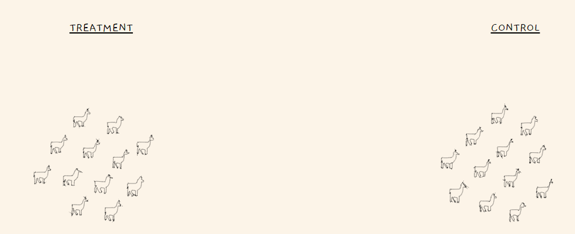

### Overview:

두 집단 A,B 를 비교할 때, 가장 많이 사용되는 통계적 분석 방법에는 student T-test 가 있다. 

하지만, t- test는 normality 의 assumption 하에서 분석이 진행되는데, 이 normality assumption은 매우 큰 가정이므로, 적절한 상황에서만 사용해야 한다. 하지만, 지금부터 이야기 할 Permutation test는 특별한 가정없이 어느 상황에서 사용할수 있는 강력한 통계적 기볍이다.

### Example:

본 예시는   [이 사이트](https://www.jwilber.me/permutationtest/) 에서 가져왔고, 들어가서보면 더욱 자세한 상황을 애니메이션을 통해 볼 수 있다.

알파카가 초원에 살고 있고, 알파카에게 새로운 샴푸를 적용시키는 상황을 생각해보자, 알파카농장의 주인은 새로운 샴푸가 quality를 높혀주는지 확인하고 싶어한다.  위 같은 상황에서 Permutation test 를 통해서 test를 진행해보자.

**Step 0:**  알파카의 털의 Quality를 수치화한후, 샴푸를 썼을때의 quality의 평균을 $\mu_T$, 기존방법에서의 quality의 평균을 $\mu_C$라고 했을때,  귀무가설과 대립가설을 새운다.

$H_0:$ $\mu_T=\mu_C$

$H_a$ :  $\mu_T>\mu_C$

**Step 1:** 알파카를 두그룹으로 나눈다, 새로운 샴푸를 쓰는 그룹과, 기존 샴푸를 그대로 쓰는 경우로 나누어준다. (Treatment가 새로운 샴푸, Control이 기존 샴푸)

**Step 2**. :  Test Statistic을 정의한다.

Permutation test 에서 test  statistic의 설정은 매우 자유롭다.  t-test나 z-test를 수행할 때의 test statistic을 사용해도 되지만, 간단하게, 두 집단간의 평균차를 Test statistic 으로 이용한다고 해보자. 

$$Test \ Statistic =\mu_{Treatment}-\mu_{Control}$$

**Step 3**: Permutation(Randomization) 을 실행하여 섞어준다. (만약에 새로운 샴푸를 썼을때와 쓰지 않았을 때, 별 차이가 없다면, 섞어서 과정을 반복해도 별 차이가 없어야 함을 이용한다.)

갑자기 섞는다는게 잘 받아들여지지 않을 수도 있지만, Control에있는 알파카들과 Treatment에 있는 알파카들을 랜덤하게 섞은 후 다시 두 그룹으로 나눈다. (이때는, 실제 어떤샴푸를 썼는지는 중요하지 않다. )  이 과정을 여러번 반복하고, 반복할 때마다, Test statistic을 측정한다.

과정을 수행한 후, 각 과정에서 나온 Test statistic을 히스토그램에 배치하면 위와같은 그림이 나올 것이다.  여기서 **Step 1** 에서 구한 Test statistic의 위치를 위 히스토그램에서 확인한다.

**Step 4.**  

P-value를 계산한다. P-value 는 귀무가설이 참이라는 가정하에, 귀무가설을 기각할 확률을 나타낸다. 

Permutation test에서의 P-value의 계산은 매우 간단한다. **Step 1** 에서 구한 Test statistic보다 큰 Statistic의 개수를 새어주고 , 반복한 Permutation 횟수로 나누어 주면 된다. 

위 예제에서의 P-value([위링크](https://www.jwilber.me/permutationtest/) 를 들어가면 확인 할 수 있다.) 는 0.08 이라고 한다. 

즉 5%의 significance level 하에서는 , 귀무가설을  기각할 수 없지만, 10%의 significance level 하에서는 귀무가설을 기각 할 수 있게된다. (목장 주인 입장에서는 어느 significance level 을 설정하냐에 따라서, 새로운 샴푸를 쓸지 말지 결정하면 된다.)

### 각종 출처
https://www.jwilber.me/permutationtest/